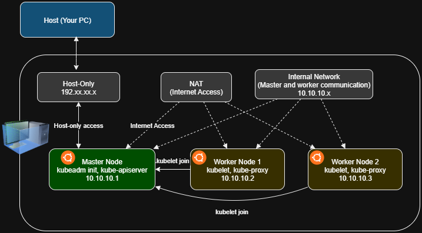
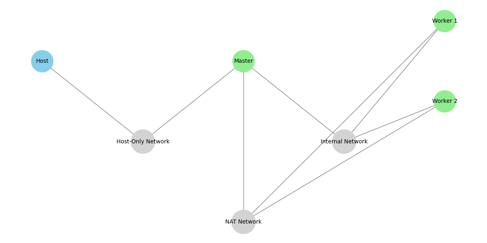

# Kubernetes 1.30.8 Cluster Setup on Ubuntu 24.04.1 LTS

This guide provides instructions for setting up a Kubernetes cluster (version 1.30.4) on Ubuntu 24.04.1 with a minimal server installation. The setup requires three Ubuntu 24.04 servers (with minimal installation): one for the master node and two for worker nodes.

## Prerequisites

- Ubuntu 24.04.1 Minimal Server is installed on all nodes with the SSH server enabled.
- Access to the internet.
- User with `sudo` privileges.
- Configure bridge networking for external communication (e.g., SSH access) and NAT networking for communication between all nodes within the cluster.
- For the master node, a minimum of 2 CPUs is required, and all other nodes should have at least 50 GB of hard disk space.


   


## Step-by-Step Installation
# Kubernetes with VirtualBox (K8s Lab Setup)

This guide documents the network configuration for setting up a Kubernetes cluster using VirtualBox with one master node and multiple worker nodes.

---

   

## 🖥️ Master Node Setup

### 1. Network Adapters for Master
- **Adapter 1**: NAT (for Internet access)
- **Adapter 2**: Host-Only (for host access) [Please confirm enp0s8 created ]
- **Adapter 3**: Internal Network (for cluster communication)[Please confirm enp0s9 created ]

---

### 2. Configure Host-Only Adapter (enp0s8)

#### Create Host-Only Network:
- In VirtualBox, go to **File > Host Network Manager**
- Create a **Host-Only Network** and ensure **DHCP Server** is enabled.

#### Update Netplan Configuration:

Edit the netplan configuration:

```bash
sudo nano /etc/netplan/50-cloud-init.yaml
```
Update with the following block:

```yaml
 enp0s8:
  dhcp4: true
 ```
Apply Changes:
```bash
sudo netplan apply
sudo reboot
```
Verify IP Address:
After reboot:

```bash
ip a
```
You should see an IP assigned to enp0s8.
If not, manually request a DHCP lease:

```bash
sudo dhclient -1 enp0s8
```
💡 If dhclient is not installed, you can install it:

```bash
sudo apt update
sudo apt install isc-dhcp-client
```
### 3. Configure Internal Network (enp0s9)
Update Netplan for the internal adapter:

```bash
sudo nano /etc/netplan/50-cloud-init.yaml
```
Add or edit this block:

```yaml
enp0s9:
  dhcp4: no
  addresses: [10.10.10.1/24]
```
Apply configuration:

```bash
sudo netplan apply
```
---
## 🖥️ Worker Node Setup

### 1. Network Adapters for Master
- **Adapter 1**: NAT (for Internet access)
- **Adapter 2**: Internal Network (for cluster communication)[Please confirm enp0s8 created ]
---
### 2. Configure Internal Network (enp0s8)
Update Netplan for the internal adapter:

```bash
sudo nano /etc/netplan/50-cloud-init.yaml
```
Add or edit this block:

```yaml
enp0s8:
  dhcp4: no
  addresses: [10.10.10.2/24]
```
Apply configuration:

```bash
sudo netplan apply
```
## Network Summary

| Node        | Adapter   | Interface | Purpose               | IP Address          |
| ----------- | --------- | --------- | --------------------- | ------------------- |
| Master      | NAT       | enp0s3    | Internet access       | DHCP (auto)         |
| Master      | Host-Only | enp0s8    | Access from host      | 192.x.x.x (DHCP) |
| Master      | Internal  | enp0s9    | Cluster communication | `10.10.10.1`        |
| Worker Node | NAT       | enp0s3    | Internet access       | DHCP (auto)         |
| Worker Node | Internal  | enp0s9    | Cluster communication | `10.10.10.2+`       |


##  At this point, we assume the VirtualBox VMs have been created with the following network adapters:

Master Node: Adapter 1 (NAT), Adapter 2 (Host-Only), Adapter 3 (Internal)

Worker Nodes: Adapter 1 (NAT), Adapter 2 (Internal)

Now, we will proceed to install Kubernetes, initialize the cluster on the master node, and join the worker nodes to form a complete Kubernetes cluster.

## Installing Kubernetes Components (kubeadm, kubelet, kubectl)

### Step 1: Disable Swap (all nodes)

To check if swap is enabled, use the following command:

```bash
 free -h
```

If swap is enabled, run the following commands to disable it:

```bash
swapoff -a
sed -i '/ swap / s/^\(.*\)$/#\1/g' /etc/fstab
```

Next, confirm that the swap has been commented out in the /etc/fstab file. Open the file with:

sudo nano /etc/fstab

If the swap entry is not commented, please add a # at the beginning of the line to comment it out, then save the file

### Step 2: Enable IPv4 Packet Forwarding (all nodes)

#### sysctl params required by setup, params persist across reboots

```bash
cat <<EOF | sudo tee /etc/sysctl.d/k8s.conf
net.ipv4.ip_forward = 1
EOF
```

#### Apply sysctl params without reboot

```bash
sudo sysctl --system
```

### Step 3: Verify IPv4 Packet Forwarding (all nodes)

```bash
sysctl net.ipv4.ip_forward
```

### Step 4: Install containerd (all nodes)

```bash
# Add Docker's official GPG key:
sudo apt-get update
sudo apt-get install ca-certificates curl
sudo install -m 0755 -d /etc/apt/keyrings
sudo curl -fsSL https://download.docker.com/linux/ubuntu/gpg -o /etc/apt/keyrings/docker.asc
sudo chmod a+r /etc/apt/keyrings/docker.asc

# Add the repository to Apt sources:
echo \
  "deb [arch=$(dpkg --print-architecture) signed-by=/etc/apt/keyrings/docker.asc] https://download.docker.com/linux/ubuntu \
  $(. /etc/os-release && echo "$VERSION_CODENAME") stable" | \
  sudo tee /etc/apt/sources.list.d/docker.list > /dev/null
sudo apt-get update && sudo apt-get install containerd.io && systemctl enable --now containerd
```

### Step 5: Install CNI Plugin (all nodes)

```bash
wget https://github.com/containernetworking/plugins/releases/download/v1.4.0/cni-plugins-linux-amd64-v1.4.0.tgz
mkdir -p /opt/cni/bin
tar Cxzvf /opt/cni/bin cni-plugins-linux-amd64-v1.4.0.tgz
```

### Step 6: Forward IPv4 and Configure iptables (all nodes)

```bash
cat <<EOF | sudo tee /etc/modules-load.d/k8s.conf
overlay
br_netfilter
EOF
sudo modprobe overlay
sudo modprobe br_netfilter

cat <<EOF | sudo tee /etc/sysctl.d/k8s.conf
net.bridge.bridge-nf-call-iptables = 1
net.bridge.bridge-nf-call-ip6tables = 1
net.ipv4.ip_forward = 1
EOF

sudo sysctl --system
sysctl net.bridge.bridge-nf-call-iptables net.bridge.bridge-nf-call-ip6tables net.ipv4.ip_forward
modprobe br_netfilter
sysctl -p /etc/sysctl.conf
```

### Step 7: Modify containerd Configuration for systemd Support (all nodes)

```bash
sudo nano /etc/containerd/config.toml
```

#### Paste the configuration into the file and save it.

```bash
  disabled_plugins = []
  imports = []
  oom_score = 0
  plugin_dir = ""
  required_plugins = []
  root = "/var/lib/containerd"
  state = "/run/containerd"
  version = 2

  [cgroup]
  path = ""

  [debug]
  address = ""
  format = ""
  gid = 0
  level = ""
  uid = 0

  [grpc]
  address = "/run/containerd/containerd.sock"
  gid = 0
  max_recv_message_size = 16777216
  max_send_message_size = 16777216
  tcp_address = ""
  tcp_tls_cert = ""
  tcp_tls_key = ""
  uid = 0

  [metrics]
  address = ""
  grpc_histogram = false

  [plugins]

  [plugins."io.containerd.gc.v1.scheduler"]
  deletion_threshold = 0
  mutation_threshold = 100
  pause_threshold = 0.02
  schedule_delay = "0s"
  startup_delay = "100ms"

  [plugins."io.containerd.grpc.v1.cri"]
  disable_apparmor = false
  disable_cgroup = false
  disable_hugetlb_controller = true
  disable_proc_mount = false
  disable_tcp_service = true
  enable_selinux = false
  enable_tls_streaming = false
  ignore_image_defined_volumes = false
  max_concurrent_downloads = 3
  max_container_log_line_size = 16384
  netns_mounts_under_state_dir = false
  restrict_oom_score_adj = false
  sandbox_image = "k8s.gcr.io/pause:3.5"
  selinux_category_range = 1024
  stats_collect_period = 10
  stream_idle_timeout = "4h0m0s"
  stream_server_address = "127.0.0.1"
  stream_server_port = "0"
  systemd_cgroup = false
  tolerate_missing_hugetlb_controller = true
  unset_seccomp_profile = ""

  [plugins."io.containerd.grpc.v1.cri".cni]
  bin_dir = "/opt/cni/bin"
  conf_dir = "/etc/cni/net.d"
  conf_template = ""
  max_conf_num = 1

  [plugins."io.containerd.grpc.v1.cri".containerd]
  default_runtime_name = "runc"
  disable_snapshot_annotations = true
  discard_unpacked_layers = false
  no_pivot = false
  snapshotter = "overlayfs"

  [plugins."io.containerd.grpc.v1.cri".containerd.default_runtime]
    base_runtime_spec = ""
    container_annotations = []
    pod_annotations = []
    privileged_without_host_devices = false
    runtime_engine = ""
    runtime_root = ""
    runtime_type = ""

    [plugins."io.containerd.grpc.v1.cri".containerd.default_runtime.options]

  [plugins."io.containerd.grpc.v1.cri".containerd.runtimes]

    [plugins."io.containerd.grpc.v1.cri".containerd.runtimes.runc]
      base_runtime_spec = ""
      container_annotations = []
      pod_annotations = []
      privileged_without_host_devices = false
      runtime_engine = ""
      runtime_root = ""
      runtime_type = "io.containerd.runc.v2"

      [plugins."io.containerd.grpc.v1.cri".containerd.runtimes.runc.options]
        BinaryName = ""
        CriuImagePath = ""
        CriuPath = ""
        CriuWorkPath = ""
        IoGid = 0
        IoUid = 0
        NoNewKeyring = false
        NoPivotRoot = false
        Root = ""
        ShimCgroup = ""
        SystemdCgroup = true

  [plugins."io.containerd.grpc.v1.cri".containerd.untrusted_workload_runtime]
    base_runtime_spec = ""
    container_annotations = []
    pod_annotations = []
    privileged_without_host_devices = false
    runtime_engine = ""
    runtime_root = ""
    runtime_type = ""

    [plugins."io.containerd.grpc.v1.cri".containerd.untrusted_workload_runtime.options]

  [plugins."io.containerd.grpc.v1.cri".image_decryption]
  key_model = "node"

  [plugins."io.containerd.grpc.v1.cri".registry]
  config_path = ""

  [plugins."io.containerd.grpc.v1.cri".registry.auths]

  [plugins."io.containerd.grpc.v1.cri".registry.configs]

  [plugins."io.containerd.grpc.v1.cri".registry.headers]

  [plugins."io.containerd.grpc.v1.cri".registry.mirrors]

  [plugins."io.containerd.grpc.v1.cri".x509_key_pair_streaming]
  tls_cert_file = ""
  tls_key_file = ""

  [plugins."io.containerd.internal.v1.opt"]
  path = "/opt/containerd"

  [plugins."io.containerd.internal.v1.restart"]
  interval = "10s"

  [plugins."io.containerd.metadata.v1.bolt"]
  content_sharing_policy = "shared"

  [plugins."io.containerd.monitor.v1.cgroups"]
  no_prometheus = false

  [plugins."io.containerd.runtime.v1.linux"]
  no_shim = false
  runtime = "runc"
  runtime_root = ""
  shim = "containerd-shim"
  shim_debug = false

  [plugins."io.containerd.runtime.v2.task"]
  platforms = ["linux/amd64"]

  [plugins."io.containerd.service.v1.diff-service"]
  default = ["walking"]

  [plugins."io.containerd.snapshotter.v1.aufs"]
  root_path = ""

  [plugins."io.containerd.snapshotter.v1.btrfs"]
  root_path = ""

  [plugins."io.containerd.snapshotter.v1.devmapper"]
  async_remove = false
  base_image_size = ""
  pool_name = ""
  root_path = ""

  [plugins."io.containerd.snapshotter.v1.native"]
  root_path = ""

  [plugins."io.containerd.snapshotter.v1.overlayfs"]
  root_path = ""

  [plugins."io.containerd.snapshotter.v1.zfs"]
  root_path = ""

  [proxy_plugins]

  [stream_processors]

  [stream_processors."io.containerd.ocicrypt.decoder.v1.tar"]
  accepts = ["application/vnd.oci.image.layer.v1.tar+encrypted"]
  args = ["--decryption-keys-path", "/etc/containerd/ocicrypt/keys"]
  env = ["OCICRYPT_KEYPROVIDER_CONFIG=/etc/containerd/ocicrypt/ocicrypt_keyprovider.conf"]
  path = "ctd-decoder"
  returns = "application/vnd.oci.image.layer.v1.tar"

  [stream_processors."io.containerd.ocicrypt.decoder.v1.tar.gzip"]
  accepts = ["application/vnd.oci.image.layer.v1.tar+gzip+encrypted"]
  args = ["--decryption-keys-path", "/etc/containerd/ocicrypt/keys"]
  env = ["OCICRYPT_KEYPROVIDER_CONFIG=/etc/containerd/ocicrypt/ocicrypt_keyprovider.conf"]
  path = "ctd-decoder"
  returns = "application/vnd.oci.image.layer.v1.tar+gzip"

  [timeouts]
  "io.containerd.timeout.shim.cleanup" = "5s"
  "io.containerd.timeout.shim.load" = "5s"
  "io.containerd.timeout.shim.shutdown" = "3s"
  "io.containerd.timeout.task.state" = "2s"

  [ttrpc]
  address = ""
  gid = 0
  uid = 0
```

### Step 8: Restart containerd and Check the Status (all nodes)

```bash
sudo systemctl restart containerd && systemctl status containerd
```

### Step 9: Install kubeadm, kubelet, and kubectl (all nodes)

```bash
sudo apt-get update
sudo apt-get install -y apt-transport-https ca-certificates curl gpg

sudo mkdir -p -m 755 /etc/apt/keyrings
curl -fsSL https://pkgs.k8s.io/core:/stable:/v1.30/deb/Release.key | sudo gpg --dearmor -o /etc/apt/keyrings/kubernetes-apt-keyring.gpg
echo 'deb [signed-by=/etc/apt/keyrings/kubernetes-apt-keyring.gpg] https://pkgs.k8s.io/core:/stable:/v1.30/deb/ /' | sudo tee /etc/apt/sources.list.d/kubernetes.list

sudo apt-get update -y
sudo apt-get install -y kubelet kubeadm kubectl
sudo apt-mark hold kubelet kubeadm kubectl
```

### Step 10: Initialize the Cluster and Install CNI (only on master)

```bash
sudo kubeadm config images pull

sudo kubeadm init \
  --pod-network-cidr=10.244.0.0/16 \
  --service-cidr=10.100.0.0/16 \
  --apiserver-advertise-address=10.10.10.1 \
  --apiserver-cert-extra-sans=192.x.x.x

```
📝 Explanation:

  --pod-network-cidr: Used by your CNI plugin (e.g., Flannel uses 10.244.0.0/16)

  --service-cidr: Internal virtual IP range for services

  --apiserver-advertise-address: Internal IP of master (used by other nodes to connect)

  --apiserver-cert-extra-sans: Adds your Host-Only IP (e.g., 192.168.56.101) to the API server certificate — allows secure access from the host using kubectl.

#### After Initialzing the Cluster Connect to it and apply the CNI yaml (We're using Weave CNI in this guide)

```bash
#To start using your cluster, you need to run the following as a regular user:

mkdir -p $HOME/.kube
sudo cp -i /etc/kubernetes/admin.conf $HOME/.kube/config
sudo chown $(id -u):$(id -g) $HOME/.kube/config

#Alternatively, if you are the root user, you can run:

export KUBECONFIG=/etc/kubernetes/admin.conf
```

```bash
#Apply the CNI YAML
kubectl apply -f https://reweave.azurewebsites.net/k8s/v1.30/net.yaml
```

#### Step 11: Setting a Static Node IP for Kubelet  
*(Essential for stable internal communication between master and worker nodes)*

By default, the kubelet may pick the wrong IP address (e.g., NAT or Host-Only interface), which can break internal communication within the cluster.

To ensure each node advertises its **internal network IP** (e.g., `10.10.10.x`), you must explicitly set the `--node-ip` for kubelet.

This step is required on **both the master node** (after `kubeadm init`) and **each worker node** (after `kubeadm join`).
 
After kubeadm init, edit the kubelet config:

```bash
sudo nano /var/lib/kubelet/kubeadm-flags.env
```
Append this to the existing flags:

```ini
--node-ip=10.10.10.1
```
Then restart kubelet:

```bash
sudo systemctl restart kubelet
```
You can verify what IP kubelet is reporting to the cluster with:

```bash
kubectl get nodes -o wide

```
This ensures that Kubernetes reports the correct `InternalIP` 

### Step 11: Join Worker Nodes to the Cluster

#### Run the command generated after initializing the master node on each worker node. For example:

```bash
kubeadm join 10.10.10.1:6443 --token zcijug.ye3vrct74itrkesp \
        --discovery-token-ca-cert-hash sha256:e9dd1a0638a5a1aa1850c16f4c9eeaa2e58d03fsefg0403f587c69502570c9cd
```

After you've joined the cluster using the kubeadm join command, do the same:

```bash
sudo nano /var/lib/kubelet/kubeadm-flags.env
```

```ini
--node-ip=10.10.10.2  # Use the actual internal IP of this worker node
```
Then restart:

```bash
sudo systemctl restart kubelet
```

⚠️ Note: Make sure you set --node-ip to the actual internal IP of the current node.
For example:

Master: --node-ip=10.10.10.1

Worker 1: --node-ip=10.10.10.2

Worker 2: --node-ip=10.10.10.3


## Final Node Verification Steps

#### 1. Check nodes status
Run this from your machine with kubeconfig set up (control plane or your Windows host with access):

```bash
Copy
Edit
kubectl get nodes
```
What to look for:

Nodes listed with STATUS Ready

Appropriate ROLES (e.g., control-plane, worker)

AGE and VERSION are as expected

Example output:

```pgsql
Copy
Edit
NAME           STATUS   ROLES           AGE     VERSION
master-node    Ready    control-plane   1d      v1.27.1
worker-node1   Ready    <none>          1d      v1.27.1
```
2. Check system pods in kube-system namespace
Verify core components are running:

```bash
kubectl get pods -n kube-system
```
All pods should be Running or Completed, no CrashLoopBackOff or errors.

3. Verify networking
Try a simple pod to test networking:

```bash
kubectl run busybox --image=busybox --command -- sleep 3600
kubectl exec -it busybox -- ping -c 3 google.com
kubectl delete pod busybox
```
This confirms pods can reach outside networks.

4. Check kubelet service on each node
On each node (especially if you have access):

```bash
sudo systemctl status kubelet
```
It should be active (running) without errors.

5. Check certificates and cluster-info
```bash
kubectl cluster-info
```
Should return API server URL and other info without errors.
 
 
---
---

### Useful debugging commands:

#### kubectl cluster-info

The kubectl cluster-info command provides information about the Kubernetes cluster's master and services, including the URL for the Kubernetes API server and the cluster's DNS service.

```bash
kubectl cluster-info
```
The command will display the addresses of the Kubernetes master and DNS services. For example:

```ruby
Kubernetes master is running at https://10.10.10.1:6443
KubeDNS is running at https://10.10.10.1:6443/api/v1/namespaces/kube-system/services/kube-dns:dns/proxy
```
This helps you confirm the connectivity to the cluster and the status of the cluster services.

#### kubectl get pods -n kube-system

 Following command will show the status of all pods running in the kube-system namespace, which contains essential Kubernetes system components:

  ```bash
 kubectl get pods -n kube-system
  ```
  This allows you to monitor the health and status of core Kubernetes services, such as the API server, controller manager, scheduler, and DNS.

#### To retrieve API server logs:

The following command will retrieve the API server logs from the kubelet service:

```bash
sudo journalctl -u kubelet | grep kube-apiserver
```

This command will filter the logs to show entries related to the Kubernetes API server, helping you diagnose issues or monitor activity.

#### Inspect Pod Events:

To inspect the events of a specific pod, such as kube-apiserver-<node-name>, use the command below:

```bash
kubectl describe pod -n kube-system kube-apiserver-<node-name>
```
This command will provide detailed information about the pod and any related events.

#### Check SSL Errors:

To check for SSL/TLS errors when connecting to the Kubernetes API server, use the following

```bash
     openssl s_client -connect 10.10.10.1:6443
```

This will help you troubleshoot any SSL-related issues when connecting to the API server.

#### Restart Kubelet:

If you need to restart the kubelet service on the node, use this command:

```bash
sudo systemctl restart kubelet
```

This can help resolve issues with the kubelet service and re-initiate the necessary processes.

### Reset your cluster (This will  delete the cluster related data on the machine executing below command) only in case of an error.

```bash
sudo kubeadm reset
```

Use sudo kubeadm reset to reset or revert your cluster in case of any failure or unresolved errors.

The sudo kubeadm reset command is used to undo the changes made by kubeadm init or kubeadm join. It cleans up the node by removing Kubernetes configuration files, certificates, and network settings, effectively resetting the node to a pre-setup state. This command is useful when you need to reinitialize a node, troubleshoot, or remove a node from the cluster. After running the reset command, it's recommended to clear iptables and reboot the system for a clean setup
